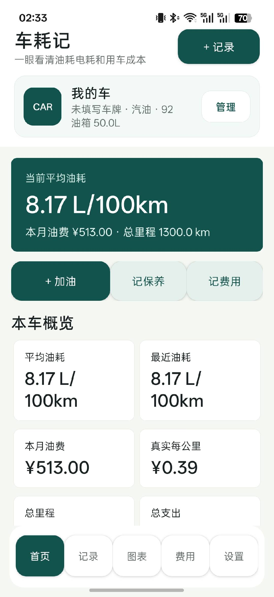
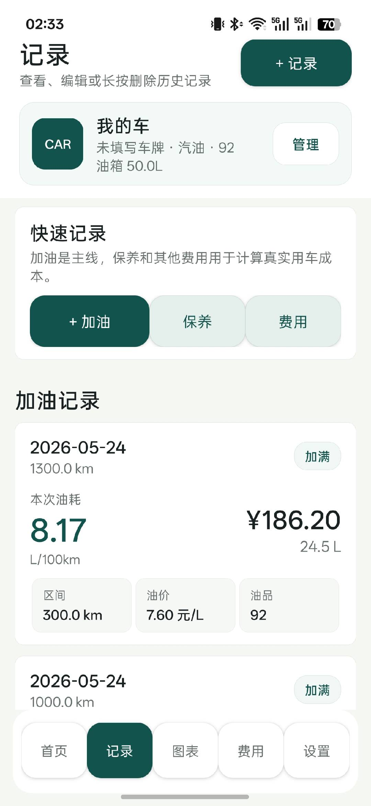
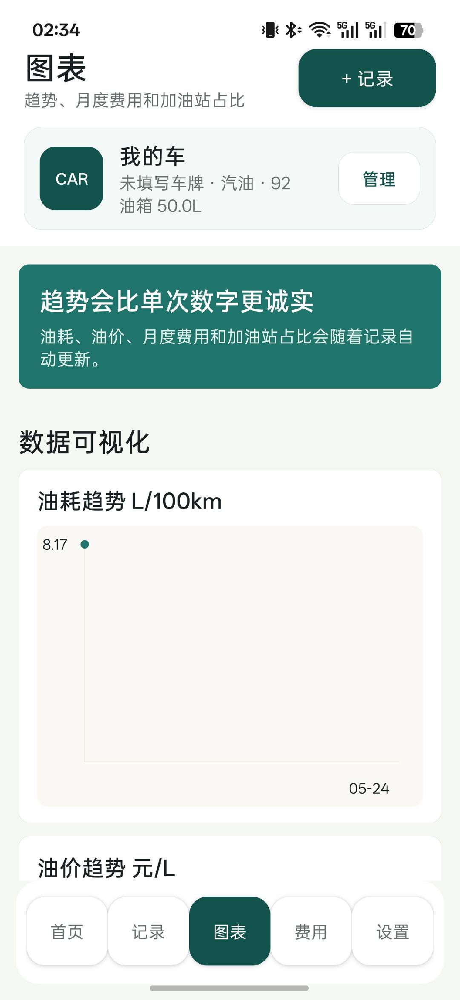
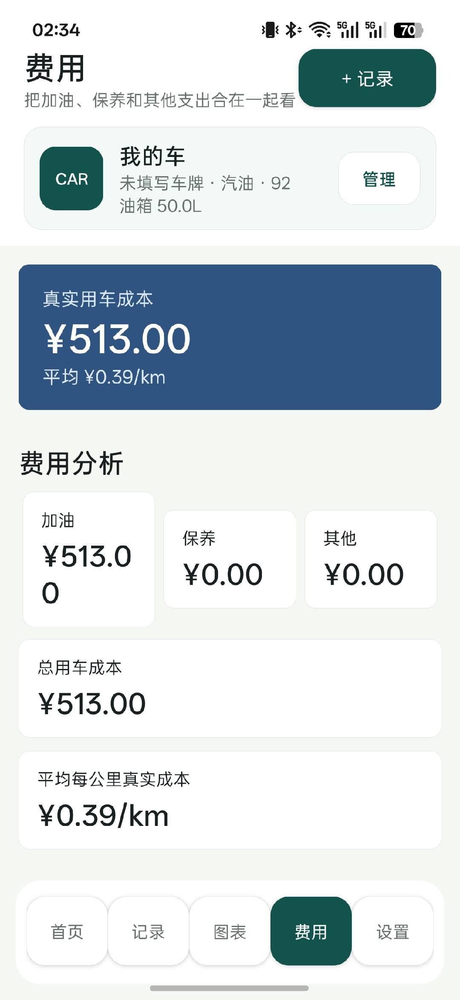
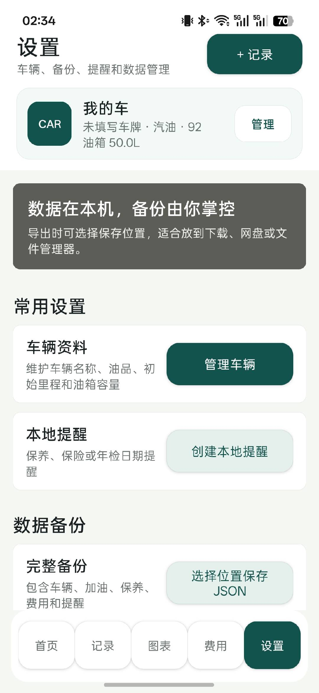

# 车耗记

车耗记是一个离线优先的 Android 车辆能耗与费用记录应用，支持油车和电车分别记录、统计和可视化。项目目前以单一 `main` 分支维护。

## 项目描述

车耗记是一款离线优先的 Android 车辆能耗与费用记录应用，支持油车和电车的加油、充电、保养、费用统计、图表分析、数据备份与本地提醒，帮助车主长期追踪真实用车成本。

## 功能

- 多车辆管理，支持油车/电车类型区分
- 加油、充电、保养、其他费用记录的新增、编辑和删除
- 油耗、电耗、单价、月度费用、站点费用占比图表
- 图表数据摘要与最近明细
- 首页概览：平均能耗、最近能耗、总里程、本月能源费用、真实每公里成本
- 本地提醒
- JSON 备份导出与导入
- CSV 表格导出
- 本地 SQLite 存储，无需登录

## 软件运行

| 首页 | 记录页 |
| --- | --- |
|  |  |

| 图表页 | 费用页 |
| --- | --- |
|  |  |

| 设置页 |
| --- |
|  |

## 目录

```text
app/                  Android 应用源码与资源
app/libs/             第三方 AAR 依赖
docs/screenshots/     README 截图
dist/                 本地构建输出
build-apk.sh          构建调试签名 APK
build-release.sh      构建正式签名 APK
build-release-aab.sh  构建 AAB
```

## 构建

环境要求：

- Android SDK 35 build-tools
- JDK 17

构建 APK：

```bash
./build-apk.sh
```

构建正式签名 APK：

```bash
./build-release.sh
```

输出文件：

```text
dist/车耗记.apk
dist/车耗记-release.apk
```

## 数据说明

应用数据默认保存在本地 SQLite 数据库中。JSON 备份可用于迁移或恢复，CSV 导出用于查看加油/充电记录表格。

## License

Copyright (c) 2026 BILSON093.

This project is source-available for non-commercial use only. Commercial use,
redistribution in paid products, paid services, advertising-supported releases,
subscriptions, in-app purchases, and other revenue-generating uses require prior
written permission from BILSON093. See [LICENSE](LICENSE) for details.
